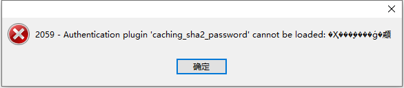

# 介绍

[MySql](https://www.mysql.com/) 是一个关系型数据库管理系统。

## 位运算

?> 在实际开发场景中，经常会存在这样一个需求，需要给数据做很多的标记，简单的方法当然是为每个标记增加一个字段，标记数量很少倒还行，但是标记数量很多，同接下来的方法，这个方法就显得相形见绌了。

> [数据库单字段存储多个标签(位移操作)](https://blog.csdn.net/weixin_43939924/article/details/126089891)

#### 增加测试表和数据

```sql
create table test
(
    id      int unsigned auto_increment
        primary key,
    tag_bit bit(10) null
);

INSERT INTO test (id, tag_bit) VALUES (1, b'0000000000');
INSERT INTO test (id, tag_bit) VALUES (2, b'0000000001');
INSERT INTO test (id, tag_bit) VALUES (3, b'0000000010');
INSERT INTO test (id, tag_bit) VALUES (4, b'0000000011');
INSERT INTO test (id, tag_bit) VALUES (5, b'0000000100');
INSERT INTO test (id, tag_bit) VALUES (6, b'0000000101');
INSERT INTO test (id, tag_bit) VALUES (7, b'0000000111');
INSERT INTO test (id, tag_bit) VALUES (8, b'0000001000');
INSERT INTO test (id, tag_bit) VALUES (9, b'0000001001');
INSERT INTO test (id, tag_bit) VALUES (10, b'0000001010');
INSERT INTO test (id, tag_bit) VALUES (11, b'0000001011');
INSERT INTO test (id, tag_bit) VALUES (12, b'0000001100');
INSERT INTO test (id, tag_bit) VALUES (13, b'0000001101');
INSERT INTO test (id, tag_bit) VALUES (14, b'0000001110');
INSERT INTO test (id, tag_bit) VALUES (15, b'0000001111');
```

#### 具体实现：

```sql
# 假设目前只使用到 4 位，从右到左依次分别为：绑定钉钉标记、绑定QQ标记、绑定微信标记、绑定GitHub标记
# 0000 都未标记
# 0001 已绑定钉钉
# 0010 已绑定QQ
# 0100 已绑定微信
# 1000 已绑定GitHub

# 查询已绑定QQ的数据 xx1x
select * from test where tag_bit & b'0010' = b'10'; # 写法一
select * from test where tag_bit & (1 << 1) = 1 << 1; # 写法二

# 查询已绑定微信并且绑定钉钉的数据 x1x1
select * from test where tag_bit & b'101' = b'101'; # 写法一
select * from test where tag_bit & (5 << 0) = (5 << 0); # 写法二
select * from test where tag_bit & (1 << 2 | 1 << 0) = (1 << 2 | 1 << 0); # 写法三

# 查询已绑定GitHub并且未绑定钉钉的数据 1xx0
select * from test where tag_bit & 1000 + 1 = b'1000'; # 写法二
select * from test where tag_bit & (1 << 3) + 1 = (8 << 0); # 写法三

# 查询已绑定GitHub并且未绑定微信的数据 10xx
select * from test where tag_bit & 1000 + 1 = b'1000'; # 写法一
select * from test where tag_bit & (1 << 3) + (1 << 2) = (8 << 0); # 写法二

# 查询绑定数据的具体情况
select id,
       (tag_bit & (1 << 3) != 0) as 'GitHub',
       (tag_bit & (1 << 2) != 0) as '微信',
       (tag_bit & (1 << 1) != 0) as 'QQ',
       (tag_bit & (1 << 0) != 0) as '钉钉'
from test;

# 指定数据增加标签
update test set tag_bit = 1 << 2 where id = 1; # 单个标签
update test set tag_bit = (1 << 2 | 1 << 3) where id = 1; # 多个标签

# 指定数据删除标签
update test set tag_bit = tag_bit ^ (1 << 2) where id = 1;
update test set tag_bit = tag_bit ^ (1 << 2 | 1 << 3) where id = 1; # 多个标签
```

## 常见问题

### 1、`Navicat` 连接 `MySQL 8` 出现 2059 错误

##### 错误：

使用 `Navicat Premium` 连接 `MySQL` 时出现如下错误：



##### 原因：

`mysql 8` 之前的版本中加密规则是 `mysql_native_password` ，而在 `mysql 8` 之后，加密规则是 `caching_sha2_password` 。

##### 解决：

更改加密规则

```mysql
$ mysql -uroot -ppassword #登录

> use mysql; #选择数据库

> ALTER USER 'root'@'localhost' IDENTIFIED BY 'password' PASSWORD EXPIRE NEVER; #更改加密方式 localhost 可以是 %

> ALTER USER 'root'@'localhost' IDENTIFIED WITH mysql_native_password BY 'password'; #更新用户密码 localhost 可以是 %

> FLUSH PRIVILEGES; #刷新权限
```


### 2、Mysql 数据表中删除重复的数据，并保留其中一条数据

执行 `sql` ：

```mysql
DELETE FROM `qimen_deliveryorder` WHERE `id` IN (
	SELECT a.`id`,`trade_id`  FROM (
    	SELECT id,trade_id,COUNT(*) as c   FROM `qimen_deliveryorder` GROUP BY `trade_id` HAVING COUNT(*) >= 2 ORDER BY c DESC
    ) as a 
)
```


### 3、 `Mysql binlog` 日志

```shell
/www/server/mysql/bin/mysqlbinlog --start-datetime="2021-01-14 01:00:00" --stop-datetime="2021-01-14 14:00:00" /www/server/data/mysql-bin.000084 -r afind1.sql
```

