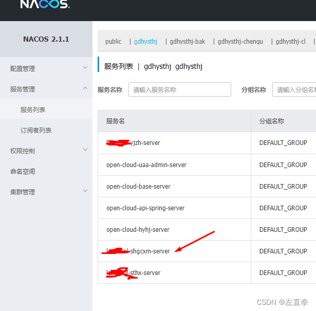
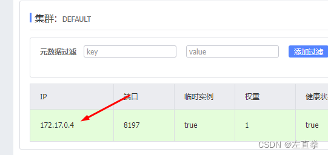
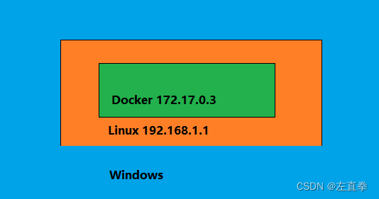
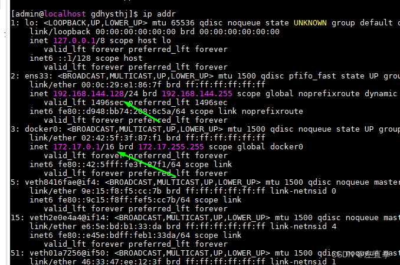

# Hyperf

## 安装

我们使用 `Docker` 安装

```shell
docker pull hyperf/hyperf

docker pull hyperf/hyperf:8.0-alpine-v3.16-swoole
```

运行镜像

```shell
docker run --name hyperf \
-v G:\Docker:/data/project \
-p 9501:9501 -it \
--privileged -u root \
--entrypoint /bin/sh \
hyperf/hyperf:8.0-alpine-v3.16-swoole

# docker run --name hyperf -v G:\Docker:/data/project -p 9501:9501 -it --privileged -u root --entrypoint /bin/sh hyperf/hyperf:8.0-alpine-v3.16-swoole

#docker run --name hyperf -v D:\Docker\dnmp\www:/data/project -p 9501-9503:9501-9503/tcp -it --privileged -u root --entrypoint /bin/sh hyperf/hyperf:8.0-alpine-v3.16-swoole
```

这样我们就进入到容器了，接下来可以使用 `Composer` 安装 `Hyperf`

```shell
cd /data/project
composer create-project hyperf/hyperf-skeleton
```

安装默认的配置后可以启动

启动命令

```shell
php bin/hyperf.php start
```


## 微服务

> [PHP写微服务之Hyperf](https://developer.aliyun.com/article/1279660)
>
> [GRPC与JSON-RPC区别 ](https://www.cnblogs.com/zccst/p/17070821.html)
>
> [微服务该如何划分？](https://www.zhihu.com/question/406526550/answer/3053339638?utm_id=0)
>
> [Hyperf服务注册之consul](https://www.imooc.com/article/322509)
>
> [使用consul注册中心，Hyperf框架之间进行RPC互相调用](https://juejin.cn/post/7125274400676380709)
>
> [Hyperf框架 - 基于Json-Rpc与Consul的微服务搭建](https://blog.csdn.net/raoxiaoya/article/details/107718941)
>
> [6、Hyperf 3 微服务系列 - 异常处理，返回相关格式的数据](https://ziruchu.com/art/661)


### 服务中心之 `consul`

```shell
docker pull consul

docker run --name=consul -p 8500:8500 -e CONSUL_BIND_INTERFACE=eth0 -d consul:1.15.4
```

单独访问服务：
```shell
curl http://localhost:9504

{
    "jsonrpc": "2.0",
    "method": "notify/add",
    "params": {
        "a": 100,
        "b": 202
    },
    "id": "",
    "context": []
}
```


### 服务中心之 `nacos`

> [Nacos 的一条注册请求会经历什么？](https://nacos.io/blog/article-nacos-reigster-mechanism/)

```shell
docker pull nacos/nacos-server # https://hub.docker.com/r/nacos/nacos-server

docker run -p 8848-8858:8848-8858/tcp --name nacos -d nacos/nacos-server # 后台运行

docker run -p 8848-8858:8848-8858/tcp --name nacos -d nacos/nacos-server
# 7d1194d131a5bf08ffe80c88ebdadd44002db06c299dcb805f830147002fbaac

# 复制容器内的 /home/nacos 目录下的 log data conf 目录到宿主机 7d11 为 容器 id
docker cp 7d11:/home/nacos/conf D:\nacos\conf
# Successfully copied 65.5kB to D:\nacos\conf
docker cp 7d11:/home/nacos/logs D:\nacos\logs
# Successfully copied 298kB to D:\nacos\logs
docker cp 7d11:/home/nacos/data D:\nacos\data
# Successfully copied 158kB to D:\nacos\data

# 正式运行
docker run --name nacos \
-e MODE=standalone \
-e SPRING_DATASOURCE_PLATFORM=mysql \
-e MYSQL_SERVICE_HOST=rm-bp108fv564w70h289wo.mysql.rds.aliyuncs.com \
-e MYSQL_SERVICE_PORT=3306 \
-e MYSQL_SERVICE_DB_NAME=rpc_nacos \
-e MYSQL_SERVICE_USER=userName \
-e MYSQL_SERVICE_PASSWORD='password' \
-p 8848:8848 \
nacos/nacos-server

# docker run --name nacos -e MODE=standalone -e SPRING_DATASOURCE_PLATFORM=mysql -e MYSQL_SERVICE_HOST=rm-bp108fv564w70h289wo.mysql.rds.aliyuncs.com -e MYSQL_SERVICE_PORT=3306 -e MYSQL_SERVICE_DB_NAME=rpc_nacos -e MYSQL_SERVICE_USER=syd_sys -e MYSQL_SERVICE_PASSWORD='1LePl9X1Z7yRNe&3' -p 8848:8848 nacos/nacos-server
```

上述命令中的 `SPRING_DATASOURCE_PLATFORM` 等入参，存在于 `/home/nacos/conf/application.properties`

若执行后报错：`Nacos Server did not start because dumpservice bean construction failure : No DataSource set`

则需要创建对应的 `MYSQL_SERVICE_DB_NAME` 的库，并执行 `/home/nacos/conf/mysql-schema.sql` 脚本或数据库配置不正常。


## 推荐组件

### 行为验证码组件

?>   行为验证码采用嵌入式集成方式，接入方便，安全，高效。抛弃了传统字符型验证码展示-填写字符-比对答案的流程，采用验证码展示-采集用户行为-分析用户行为流程，用户只需要产生指定的行为轨迹，不需要键盘手动输入，极大优化了传统验证码用户体验不佳的问题；同时，快速、准确的返回人机判定结果。目前对外提供两种类型的验证码，其中包含滑动拼图、文字点选。

>  [GitHub AJ-Captcha](https://github.com/anji-plus/captcha)
>
> [文档](https://ajcaptcha.beliefteam.cn/captcha-doc/)

`composer` 安装：

```shell
composer require fastknife/ajcaptcha
```


## Q&A

1. ### `Nacos` 不同服务器内网 `ip` 访问失败问题

   > [虚拟机中docker承载的微服务注册到nacos无法访问问题](https://huaweicloud.csdn.net/638db205dacf622b8df8c80a.html)
   
   #### 虚拟机中docker承载的微服务注册到nacos无法访问问题

   今天将一个项目中的部分子系统部署，部署到虚拟机的docker里运行，结果外部无法访问。查看nacos，显示服务已经成功注册。
   
   后来发现，该服务的IP地址外部无法访问：
   
   估计172.17.0.0是docker自身的网段，在上面跑的程序，注册到nacos，直接就用到了docker里的地址。因为对于应用程序来说，docker是容器，就是一个[操作系统](https://link.csdn.net/?target=https%3A%2F%2Fauth.huaweicloud.com%2Fauthui%2Fsaml%2Flogin%3FxAccountType%3Dcsdndev_IDP%26isFirstLogin%3Dfalse%26service%3Dhttps%3A%2F%2Flab.huaweicloud.com%2Fexperiment-detail_2384%3Futm_source%3Dhwc-csdn%26utm_medium%3Dshare-op%26utm_campaign%3D%26utm_content%3D%26utm_term%3D%26utm_adplace%3DAdPlace070851)。解决办法是，在虚拟机的宿主机上添加对该地址的路由。我的虚拟机装在windows下，即在windows里添加路由。
   
   操作步骤：
   
   ##### 一、查看虚拟机的ip情况
   
   运行命令：ip addr，得到
   
   
   
   
   ##### 二、宿主机上添加路由
   
   ```avrasm
   C:\Users\cq>route add -p 172.17.0.0/16 192.168.144.128
    操作完成!
   ```
   
   注意地址来自于虚拟机的ip信息。172.17.0.0/16，说明该IP的子网掩码为16位，172.17.0.0是子网地址，172.17.0.255是该子网的广播地址。192.168.144.128是虚拟机对外地址。见步骤一。
   
   如果要删掉该路由，就是
   
   ```nginx
   route delete 172.17.0.0
   ```
   
   如此，搞定矣。
   
   参考文章：
   [Windows访问Linux虚拟机里面的Docker容器](https://link.csdn.net/?target=https%3A%2F%2Fwww.taopanfeng.com%2F2020%2F06%2F05%2F2020-06-05...09.02.06%2F)
   
   ------
   
   
   
   ##### 三、一劳永逸的做法
   
   创建docker容器的时候，指定用主机[网络](https://link.csdn.net/?target=https%3A%2F%2Fauth.huaweicloud.com%2Fauthui%2Fsaml%2Flogin%3FxAccountType%3Dcsdndev_IDP%26isFirstLogin%3Dfalse%26service%3Dhttps%3A%2F%2Factivity.huaweicloud.com%2Ffree_test%2Findex.html%3Futm_source%3Dhwc-csdn%26utm_medium%3Dshare-op%26utm_campaign%3D%26utm_content%3D%26utm_term%3D%26utm_adplace%3DAdPlace070851)模式
   
   ```routeros
   --network=host
   # 例如：
   docker run -d --network=host --name app-demo registry.cn-hangzhou.aliyuncs.com/zhengqing/app-demo
   
   # docker run --name hyperfBox --network=host -v /home/wwwroot:/data/ -it --privileged -u root --entrypoint /bin/sh  hyperf/hyperf:8.0-alpine-v3.14-swoole
   ```
   
   这样注册到 `nacos` ，用的就是主机的地址，而不是 `docker` 地址。
   
   参考文章：
   [运维(10) 解决Nacos服务注册使用Docker容器内网ip问题(指定注册ip或–network=host)](https://link.csdn.net/?target=https%3A%2F%2Fblog.csdn.net%2Fqq_38225558%2Farticle%2Fdetails%2F120342534)
   
   ------
   
   但是方案三是有问题的，不一定能成功。因为使用host模式，意味着docker容器直接居于宿主机网络，完全暴露于宿主机，[安全](https://link.csdn.net/?target=https%3A%2F%2Fauth.huaweicloud.com%2Fauthui%2Fsaml%2Flogin%3FxAccountType%3Dcsdndev_IDP%26isFirstLogin%3Dfalse%26service%3Dhttps%3A%2F%2Factivity.huaweicloud.com%2Ffree_test%2Findex.html%3Futm_source%3Dhwc-csdn%26utm_medium%3Dshare-op%26utm_campaign%3D%26utm_content%3D%26utm_term%3D%26utm_adplace%3DAdPlace070851)性和区隔性都被削弱；更重要的是，应用程序需要使用的端口有可能已经被占用，从而导致无法运行。最好的办法，还是添加路由，或者需要注册到nacos的其他容器，与nacos共享[网络](https://link.csdn.net/?target=https%3A%2F%2Fauth.huaweicloud.com%2Fauthui%2Fsaml%2Flogin%3FxAccountType%3Dcsdndev_IDP%26isFirstLogin%3Dfalse%26service%3Dhttps%3A%2F%2Factivity.huaweicloud.com%2Ffree_test%2Findex.html%3Futm_source%3Dhwc-csdn%26utm_medium%3Dshare-op%26utm_campaign%3D%26utm_content%3D%26utm_term%3D%26utm_adplace%3DAdPlace070851)配置，即–net=container:nacos；如果nacos不在同一台机器，可以看看overlay模式。详见拙作：
   [采用docker部署时kafka共享zookeeper的](https://link.csdn.net/?target=https%3A%2F%2Fblog.csdn.net%2Fleftfist%2Farticle%2Fdetails%2F130582646)[网络](https://link.csdn.net/?target=https%3A%2F%2Fauth.huaweicloud.com%2Fauthui%2Fsaml%2Flogin%3FxAccountType%3Dcsdndev_IDP%26isFirstLogin%3Dfalse%26service%3Dhttps%3A%2F%2Factivity.huaweicloud.com%2Ffree_test%2Findex.html%3Futm_source%3Dhwc-csdn%26utm_medium%3Dshare-op%26utm_campaign%3D%26utm_content%3D%26utm_term%3D%26utm_adplace%3DAdPlace070851)配置。
   
   
