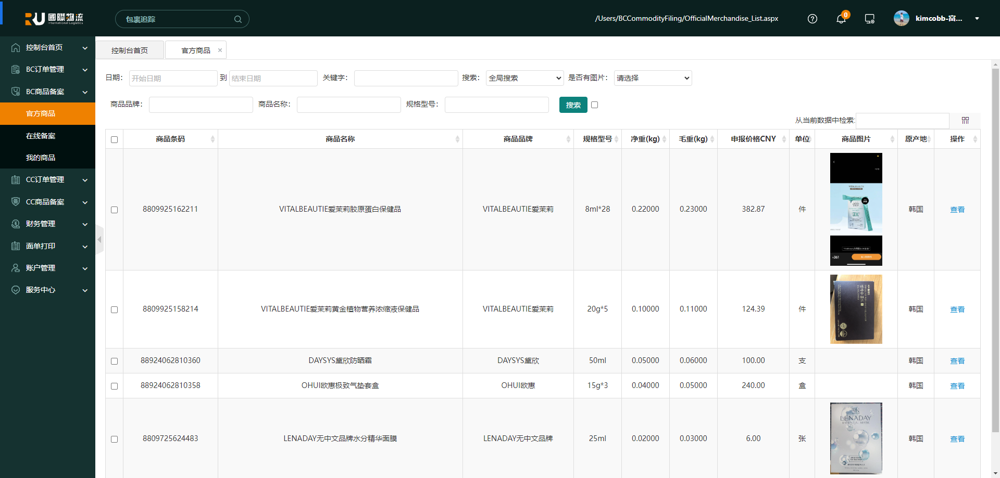

# Python


## 爬虫

淘宝秒杀示例：

```python
import datetime  # 用来处理时间
import time  # 用来处理时间
from selenium import webdriver  # 用来网页操作
from selenium.webdriver.common.by import By  # 用来定位元素

times = '2024-06-22 15:00:00'

# 启动Chrome浏览器
driver = webdriver.Chrome()
# 窗口最大化显示
driver.maximize_window()


def login(url, mall):
    '''
    登陆函数
    
    url:商品的链接
    mall：商城类别
    '''
    driver.get(url)
    driver.implicitly_wait(10)
    time.sleep(2)
    # 淘宝和天猫的登陆链接文字不同
    login_button = driver.find_element(By.CSS_SELECTOR, 'div.member-logout > a.btn-login')
    login_button.click()
    print("请在30秒内完成登录")
    # 用户扫码登陆
    time.sleep(30)


def buy(buy_time):
    '''
    购买函数
    
    buy_time:购买时间
    mall:商城类别
    
    获取页面元素的方法有很多，获取得快速准确又是程序的关键
    在写代码的时候运行测试了很多次，css_selector的方式表现最佳
    '''

    btn_buy = 'div.Actions--leftButtons--2fasaTH > button.Actions--rightBtn--31O_Xka'
    btn_order = '#submitOrder_1 > div > a'

    while True:
        # 现在时间大于预设时间则开售抢购
        if datetime.datetime.now().strftime('%Y-%m-%d %H:%M:%S.%f') > buy_time:
            try:
                # 找到“立即购买”，点击
                if driver.find_element(By.CSS_SELECTOR, btn_buy):
                    driver.find_element(By.CSS_SELECTOR, btn_buy).click()
                    break
                time.sleep(0.1)
            except:
                time.sleep(0.3)

    while True:
        try:
            # 找到“立即下单”，点击，
            if driver.find_element(By.CSS_SELECTOR, btn_buy):
                driver.find_element(By.CSS_SELECTOR, btn_buy).click()
                # 下单成功，跳转至支付页面
                print("购买成功")
                break
        except:
            time.sleep(0.5)


if __name__ == "__main__":
    '''
        url = input("请输入商品链接:")
        mall = input("请选择商城（淘宝 1  天猫 2  输入数字即可）： ")
        bt = input("请输入开售时间【2019-02-15（空格）12:55:50】")
    '''
    url = 'https://detail.tmall.com/item.htm?id=781207527937'
    mall = 1
    login(url, mall)
    bt = '2024-06-22 22:13:20'
    buy(bt)

```


### 安装

> [Python使用Selenium WebDriver的入门介绍及安装教程](https://blog.csdn.net/hubing_hust/article/details/128295216)
>
> [Download the driver](https://www.selenium.dev/zh-cn/documentation/webdriver/troubleshooting/errors/driver_location/)
>
> [chromedriver](https://developer.chrome.com/docs/chromedriver/downloads?hl=zh-cn)

```shell
# 更新 pip
pip install --upgrade pip

# 安装 selenium
pip install selenium # pip uninstall selenium
```


**目的**：获取列表商品数据，并请求查看详情获取全部数据




**代码实现**：

```python
import datetime  # 用来处理时间
import time  # 用来处理时间
from selenium import webdriver  # 用来网页操作
from selenium.webdriver.common.by import By  # 用来定位元素

times = '2024-06-22 15:00:00'

# 启动Chrome浏览器
driver = webdriver.Chrome()
# 窗口最大化显示
driver.maximize_window()


def login(url, mall):
    '''
    登陆函数
    
    url:商品的链接
    mall：商城类别
    '''
    driver.get(url)
    print("请在30秒内完成登录")
    driver.implicitly_wait(30)  # 隐式等待
    time.sleep(2)  # 强制等待
    # time.sleep(30)
    # 淘宝和天猫的登陆链接文字不同
    tbxIdUser = driver.find_element(By.CSS_SELECTOR, '#tbxIdUser')
    tbxLoginPassword = driver.find_element(By.CSS_SELECTOR, '#tbxLoginPassword')
    tbxIdUser.send_keys("name")
    tbxLoginPassword.send_keys("password")
    print("请在5秒内完成验证")
    time.sleep(5)  # 强制等待
    print("登录成功3333")
    # login_button.click()

    # try:
    #     # 找到“立即购买”，点击
    #     if driver.find_element(By.CSS_SELECTOR, '#btnLoginOk'):
    #         driver.find_element(By.CSS_SELECTOR, '#btnLoginOk').click()
    #     print("1111 休眠 1 s")
    #     time.sleep(1)
    # except:
    #     print("1111 休眠 3 s")
    #     time.sleep(3)

    print("登录成功")


def buy(buy_time):
    '''
    购买函数
    
    buy_time:购买时间
    mall:商城类别
    
    获取页面元素的方法有很多，获取得快速准确又是程序的关键
    在写代码的时候运行测试了很多次，css_selector的方式表现最佳
    '''

    btn_buy = 'div.Actions--leftButtons--2fasaTH > button.Actions--rightBtn--31O_Xka'
    btn_order = '#submitOrder_1 > div > a'

    list = 'tbody > tr'
    while True:
        print("准备获取列表元素.........")
        time.sleep(10)
        print("获取列表元素")

        print("新页面的链接：", driver.current_url)
        print("新页面的标题：", driver.title)

        # 获取列表元素
        # elements = driver.find_element(By.CSS_SELECTOR, "tbody > tr")
        #先定位到iframe

        # elementIframe= driver.find_element(By.CSS_SELECTOR,'iframe')
        # print("iframe ====> ")
        # print(elementIframe.text)
        #再将定位对象传给switch_to_frame()方法
        # driver.switch_to_frame(elementIframe)
        driver.switch_to.frame(1) # 查看页面源码搜索 iframe 数量，找到正确的 iframe 数字从 0 开始
        print("测试数据 ===> ", driver.find_element(By.CSS_SELECTOR, ".admin-content").text)
        DataTables_Table_0_wrapper = driver.find_element(By.CSS_SELECTOR, "#DataTables_Table_0_wrapper")
        print("DataTables_Table_0_wrapper ====> ")
        print(DataTables_Table_0_wrapper.text)
        tbody = DataTables_Table_0_wrapper.find_element(By.TAG_NAME, "tbody")
        trList = tbody.find_element(By.TAG_NAME, "tr")
        print("trList ====> ")
        print(trList)
        # 遍历列表元素并打印
        for trD in trList:
            for tdD in trD:
                print(tdD.text)
        # 现在时间大于预设时间则开售抢购
        if datetime.datetime.now().strftime('%Y-%m-%d %H:%M:%S.%f') > buy_time:
            try:
                # 找到“立即购买”，点击
                if driver.find_element(By.CSS_SELECTOR, btn_buy):
                    driver.find_element(By.CSS_SELECTOR, btn_buy).click()
                    break
                print("休眠 1 s")
                time.sleep(1)
            except:
                print("休眠 3 s")
                time.sleep(3)

        print("休眠 3.0 s")
        time.sleep(3)
    while True:
        try:
            # 找到“立即下单”，点击，
            if driver.find_element(By.CSS_SELECTOR, btn_buy):
                driver.find_element(By.CSS_SELECTOR, btn_buy).click()
                # 下单成功，跳转至支付页面
                print("购买成功")
                break
            print(" 22222222222 休眠 1 s")
            time.sleep(1)
        except:
            print(" 22222222222 休眠 5 s")
            time.sleep(0.5)

        print("休眠 3.1 s")
        time.sleep(3)


if __name__ == "__main__":
    '''
        url = input("请输入商品链接:")
        mall = input("请选择商城（淘宝 1  天猫 2  输入数字即可）： ")
        bt = input("请输入开售时间【2019-02-15（空格）12:55:50】")
    '''
    url = 'https://user.ruguoji.com/Users/BCCommodityFiling/OfficialMerchandise_List.aspx'
    mall = 2
    print("================== LOGIN START =====================")
    login(url, mall)
    print("================== LOGIN END =====================")
    bt = '2024-06-29 14:40:00'
    buy(bt)

```