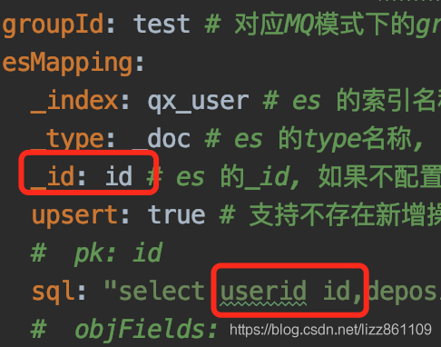

## 简介


[**canal [kə'næl]**](https://github.com/alibaba/canal.git)，译意为水道/管道/沟渠，主要用途是基于 MySQL 数据库增量日志解析，提供增量数据订阅和消费

早期阿里巴巴因为杭州和美国双机房部署，存在跨机房同步的业务需求，实现方式主要是基于业务 trigger 获取增量变更。从 2010 年开始，业务逐步尝试数据库日志解析获取增量变更进行同步，由此衍生出了大量的数据库增量订阅和消费业务。

基于日志增量订阅和消费的业务包括

- 数据库镜像
- 数据库实时备份
- 索引构建和实时维护(拆分异构索引、倒排索引等)
- 业务 cache 刷新
- 带业务逻辑的增量数据处理

当前的 canal 支持源端 MySQL 版本包括 5.1.x , 5.5.x , 5.6.x , 5.7.x , 8.0.x

---


# 工作原理

#### MySQL主备复制原理


- MySQL master 将数据变更写入二进制日志( binary log, 其中记录叫做二进制日志事件binary log events，可以通过 show binlog events 进行查看)
- MySQL slave 将 master 的 binary log events 拷贝到它的中继日志(relay log)
- MySQL slave 重放 relay log 中事件，将数据变更反映它自己的数据

#### canal 工作原理

- canal 模拟 MySQL slave 的交互协议，伪装自己为 MySQL slave ，向 MySQL master 发送dump 协议
- MySQL master 收到 dump 请求，开始推送 binary log 给 slave (即 canal )
- canal 解析 binary log 对象(原始为 byte 流)


---

# Deployer

## 准备工作

- 首先保证服务器的 `jdk` 环境已经就绪，因为 `canal` 是由 `java` 进行开发的，所以必须具备 `java` 运行环境。

##### 查看 `Mysql` 是否开启 `binlog`

```sql
show variables like 'log_bin';

show binary logs;
```


##### 授权 `canal` 链接 `MySQL` 账号具有作为 `MySQL slave` 的权限, 如果已有账户可直接 `grant`

```sql
CREATE USER canal IDENTIFIED BY 'canal';  
GRANT SELECT, REPLICATION SLAVE, REPLICATION CLIENT ON *.* TO 'canal'@'%';
-- GRANT ALL PRIVILEGES ON *.* TO 'canal'@'%' ;

FLUSH PRIVILEGES;
```


##### 安装 JDK

```shell
# 下载 tar.gz 包 https://www.oracle.com/java/technologies/javase/javase8-archive-downloads.html

# 解压 目录是 /root/JDK
tar -zxvf jdk-8u202-linux-x64.tar.gz -C JDK

# ~/.bash_profile 添加 JAVA 相关变量，如下：
vi /etc/profile
```

```properties
export JAVA_HOME=/root/JDK/jdk1.8.0_202
export JRE_HOME=${JAVA_HOME}/jre
export CLASSPATH=.:${JAVA_HOME}/lib:${JRE_HOME}/lib:$CLASSPATH
export JAVA_PATH=${JAVA_HOME}/bin:${JRE_HOME}/bin
export PATH=$JAVA_HOME/bin:$JRE_HOME/bin/$JAVA_HOME:$PATH
```

```shell
source /etc/profile # source ~/.bash_profile 刷新环境变量

java -version # 出现以下信息，说明安装成功
#[root@iZbp1a8nvld17ybfu7cemtZ ~]# java -version
#java version "1.8.0_202"
#Java(TM) SE Runtime Environment (build 1.8.0_202-b08)
#Java HotSpot(TM) 64-Bit Server VM (build 25.202-b08, mixed mode)

#[root@iZbp1a8nvld17ybfu7cemtZ ~]# which java
#/root/JDK/jdk1.8.0_202/bin/java
```


##### 下载 canal.deployer

```shell
# 下载
wget https://github.com/alibaba/canal/releases/download/canal-1.1.6/canal.deployer-1.1.6.tar.gz

# 解压到指定文件夹下
tar -zxvf canal.deployer-1.1.6.tar.gz -C ./canal/deployer
```


## 启动

##### 启动 `deployer`

配置：

```properties
canal.instance.master.address=127.0.0.1:3306 # mysql 地址
canal.instance.dbUsername=username # 用户
canal.instance.dbPassword=password # 密码
canal.instance.filter.regex=canal\\..* # 关注的表
#mysql 数据解析关注的表，Perl正则表达式.
#
#多个正则之间以逗号(,)分隔，转义符需要双斜杠(\\)
#
#常见例子：
#
#  1.  所有表：.*   or  .*\\..*
#  2.  canal schema下所有表： canal\\..*
#  3.  canal下的以canal打头的表：canal\\.canal.*
#  4.  canal schema下的一张表：canal\\.test1
#  5.  多个规则组合使用：canal\\..*,mysql.test1,mysql.test2 (逗号分隔)
```

命令：

```shell
sh bin/startup.sh # 启动
sh bin/stop.sh # 关闭
```


##### 启动 `canal-go` 客户端

- canal java 客户端: https://github.com/alibaba/canal/wiki/ClientExample
- canal c# 客户端: https://github.com/dotnetcore/CanalSharp
- canal go客户端: https://github.com/CanalClient/canal-go
- canal Python客户端: https://github.com/haozi3156666/canal-python

修改 `canal-go -> samples -> main.go` ：

```go
connector := client.NewSimpleCanalConnector("172.16.186.82", 11111, "", "", "example", 60000, 60*60*1000)
err := connector.Connect()
if err != nil {
    log.Println(err)
    os.Exit(1)
}

//err = connector.Subscribe(".*\\..*")
err = connector.Subscribe("canal\\..*")
```

命令：

```shell
go run samples/main.go
```


## FAQ / 常见问题解答

1. ##### 启动 canal 报错

   ```log
   2022-05-30 13:49:43.647 [destination = example , address = rm-bp108fv564w70h289wo.mysql.rds.aliyuncs.com/47.111.55.63:3306 , EventParser] ERROR c.a.o.c.p.inbound.mysql.rds.RdsBinlogEventParserProxy - dump address rm-bp108fv564w70h289wo.mysql.rds.aliyuncs.com/47.111.55.63:3306 has an error, retrying. caused by 
   com.google.common.util.concurrent.UncheckedExecutionException: com.alibaba.fastjson2.JSONException: read field error : clientDatas
   	at com.google.common.cache.LocalCache$Segment.get(LocalCache.java:2218) ~[guava-22.0.jar:na]
   	at com.google.common.cache.LocalCache.get(LocalCache.java:4147) ~[guava-22.0.jar:na]
   	at com.google.common.cache.LocalCache.getOrLoad(LocalCache.java:4151) ~[guava-22.0.jar:na]
   	at com.google.common.cache.LocalCache$LocalLoadingCache.get(LocalCache.java:5140) ~[guava-22.0.jar:na]
   	at com.google.common.collect.MigrateMap$MigrateConcurrentMap.get(MigrateMap.java:68) ~[canal.common-1.1.6.jar:na]
   	at com.alibaba.otter.canal.meta.MemoryMetaManager.listAllSubscribeInfo(MemoryMetaManager.java:72) ~[canal.meta-1.1.6.jar:na]
   
   ......
   ```
   
   ##### 解决方法：
   
   先停止 `canal` ，把 `conf -> example -> meta.dat` 文件删除，再重启 `canal` ;
   重启会重新生成 `meta.dat` 文件，所记录的最新 `binlog` 文件和位置。
   
   ```shell
   # insert
   ================> binlog[mysql-bin.002686 : 257880],name[test_suyoda_net,auth_center_sub_role], eventType: INSERT
   id : 12  update= true
   uid : 1  update= true
   name : XR测试2  update= true
   status : 1  update= true
   menu_ids : 96,25,26,97,98,99,100,101,102,103,104,27,28,105,29  update= true
   ================> binlog[mysql-bin.002686 : 258066],name[test_suyoda_net,auth_center_sub_role], eventType: INSERT
   id : 13  update= true
   uid : 1  update= true
   name : XR测试3  update= true
   status : 1  update= true
   menu_ids : 96,25,26,97,98,99,100,101,102,103,104,27,28,105,29  update= true
   
   
   # update
   ================> binlog[mysql-bin.002686 : 264579],name[test_suyoda_net,auth_center_sub_role], eventType: UPDATE
   -------> before
   id : 13  update= false
   uid : 1  update= false
   name : XR测试3  update= false
   status : 1  update= false
   menu_ids : 96,25,26,97,98,99,100,101,102,103,104,27,28,105,29  update= false
   -------> after
   id : 13  update= false
   uid : 1  update= false
   name : XR测试3  update= false
   status : 1  update= false
   menu_ids : 96,25,26,97,98,99,100,101,102,103,104,27,28,105,30  update= true
   ================> binlog[mysql-bin.002686 : 264838],name[test_suyoda_net,auth_center_sub_role], eventType: UPDATE
   -------> before
   id : 12  update= false
   uid : 1  update= false
   name : XR测试2  update= false
   status : 1  update= false
   menu_ids : 96,25,26,97,98,99,100,101,102,103,104,27,28,105,29  update= false
   -------> after
   id : 12  update= false
   uid : 1  update= false
   name : XR测试2  update= false
   status : 1  update= false
   menu_ids : 96,25,26,97,98,99,100,101,102,103,104,27,28,105  update= true
   
   # delete
   ================> binlog[mysql-bin.002686 : 266562],name[test_suyoda_net,auth_center_sub_role], eventType: DELETE
   id : 13  update= false
   uid : 1  update= false
   name : XR测试3  update= false
   status : 1  update= false
   menu_ids : 96,25,26,97,98,99,100,101,102,103,104,27,28,105,30  update= false
   ================> binlog[mysql-bin.002686 : 266748],name[test_suyoda_net,auth_center_sub_role], eventType: DELETE
   id : 12  update= false
   uid : 1  update= false
   name : XR测试2  update= false
   status : 1  update= false
   menu_ids : 96,25,26,97,98,99,100,101,102,103,104,27,28,105  update= false
   ```
   
   

## 参考

> [QuickStart](https://github.com/alibaba/canal/wiki/QuickStart)
>
> [alibaba/canal](https://github.com/alibaba/canal.git)
>
> [超详细的canal使用总结](https://blog.csdn.net/fei_thefirst/article/details/120727544)
>
> [超详细的Canal入门，看这篇就够了！](https://blog.csdn.net/yehongzhi1994/article/details/107880162)
>
> [Canal的简单使用](https://www.modb.pro/db/126925)
>
> [Canal高可用架构部署](https://mp.weixin.qq.com/s/QwvmxqxXirjf-J6mqYY44Q)
>
> [全量同步Elasticsearch方案之Canal](https://zhuanlan.zhihu.com/p/360631964)


---


# Adapter

?> 全量同步时使用，增量同步可以使用 [`canal-go` 客户端](https://github.com/CanalClient/canal-go)

## 同步 ES

> [ClientAdapter](https://github.com/alibaba/canal/wiki/ClientAdapter)
>
> [Sync ES](https://github.com/alibaba/canal/wiki/Sync-ES)

### 准备工作

##### 下载 canal.deployer

```shell
# 下载
wget https://github.com/alibaba/canal/releases/download/canal-1.1.6/canal.adapter-1.1.6.tar.gz

# 解压到指定文件夹下
tar -zxvf canal.adapter-1.1.6.tar.gz -C ./canal/adapter/
```


#### 配置

1. ##### 修改启动器配置: `application.yml`

   ```yaml
   canal.conf:
     canalServerHost: 127.0.0.1:11111
     batchSize: 500
     syncBatchSize: 1000
     retries: 0
     timeout:
     mode: tcp 
     srcDataSources:
       defaultDS:
         url: jdbc:mysql://127.0.0.1:3306/mytest?useUnicode=true
         username: root
         password: 121212
     canalAdapters:
     - instance: example 
       groups:
       - groupId: g1
         outerAdapters:
         - 
           key: exampleKey
           name: es6                           # or es7
           hosts: 127.0.0.1:9300               # es 集群地址, 逗号分隔
           properties:
             mode: transport # or rest         # 可指定transport模式或者rest模式
             # security.auth: test:123456      # only used for rest mode
             cluster.name: elasticsearch       # es cluster name
   ```

2. ##### 修改 `bootstrap.yml` 文件：

   ```yaml
   canal:
     manager:
       jdbc:
         url: jdbc:mysql://127.0.0.1:3306/mytest?useUnicode=true&characterEncoding=UTF-8
         username: canal
         password: canal
   ```

   

3. ##### 适配器表映射文件

   修改 `conf/es7/mytest_user.yml` 文件:

   ```yaml
   dataSourceKey: defaultDS        # 源数据源的key, 对应上面配置的srcDataSources中的值
   outerAdapterKey: exampleKey     # 对应application.yml中es配置的key 
   destination: example            # cannal的instance或者MQ的topic
   groupId:                        # 对应MQ模式下的groupId, 只会同步对应groupId的数据
   esMapping:
     _index: mytest_user           # es 的索引名称
     _type: _doc                   # es 的type名称, es7下无需配置此项
     _id: _id                      # es 的_id, 如果不配置该项必须配置下面的pk项_id则会由es自动分配
   #  pk: id                       # 如果不需要_id, 则需要指定一个属性为主键属性
     # sql映射
     sql: "select a.id as _id, a.name as _name, a.role_id as _role_id, b.role_name as _role_name,
           a.c_time as _c_time, c.labels as _labels from user a
           left join role b on b.id=a.role_id
           left join (select user_id, group_concat(label order by id desc separator ';') as labels from label
           group by user_id) c on c.user_id=a.id"
   #  objFields:
   #    _labels: array:;           # 数组或者对象属性, array:; 代表以;字段里面是以;分隔的
   #    _obj: object               # json对象
     etlCondition: "where a.c_time>='{0}'"     # etl 的条件参数
     commitBatch: 3000                         # 提交批大小
   ```


### 启动

```shell
./bin/startup.sh
```

```shell
# 全量执行同步
curl http://127.0.0.1:8091/etl/es7/mytest_user.yml -X POST
```

##### 配置：

`conf/es7mytest_user.yml`

> [enhance dbAdapter and esAdapter #4110](https://github.com/alibaba/canal/pull/4110#issue-1170531285)

```yaml
dataSourceKey: defaultDS
# outerAdapterKey: exampleKey
destination: example
groupId: g1
esMapping:
  # _index: test_order
  _index: stable_order
  _id: _id
#  upsert: true
  # pk: id
  sql: "select i.tid as _id,
        i.tid,
        o.tid as otid,
        o.uid,
        o.batch_no,
        o.tp_waybill_no,
        o.order_no,
        o.ecp_no,
        o.chanel_id,
        o.created,
        o.send_time,
        o.status,
        o.is_push_route,
        o.clear_code,
        o.channel,
        o.is_trans,
        o.ware_id,
        o.order_status,
        o.port,
        o.order_type,
        o.print_status,
        o.tp_name,
        o.main_code,
        m.admin_id,
        m.nick_name                                            as member_nick_name,
        u.user_name                                            as user_user_name,
        r.name                                                 as receiver_name,
        r.mobile                                               as receiver_mobile,
        concat(r.state, r.city, r.district, r.town, r.address) as receiver_address,
        group_concat(i.name separator ';')                     as order_info_name_string,
        FROM_UNIXTIME(c.ship_time, '%Y-%m-%dT%T+08:00')        as customs_affairs_ship_time
        from `order_info` i
        left join `order` o ON i.tid = o.tid
        left join `order_receiver` r ON o.tid = r.tid
        left join `member` m ON o.uid = m.uid
        left join `user` u ON m.admin_id = u.uid
        left join `customs_affairs` c on o.main_code = c.syd_code"
#  objFields:
#    _labels: array:;
  # 目标表别名
  targetOwner: i
  # 非 DDL 中字段的需要声明
  targetColumns:
    - order_info_name_string
    - customs_affairs_ship_time
    - receiver_address
    - member_nick_name
    - user_user_name
    - receiver_name
    - receiver_mobile
  etlCondition: "where i.tid={} group by i.tid" # group 可以写在这，不需要可以去掉
  commitBatch: 3000
```


## FAQ / 常见问题

1. #### 启动报配置的错误

   解决方法：整理一下 `application.yml` 的代码格式，缩进等。

   

2. #### 启动 adapter 报错：`Load canal adapter: es7 failed`

   ##### `Illegal character in scheme name at index 0: 47.105.210.200:30001`

   ```log
   2022-06-07 15:07:02.291 [Thread-2] ERROR c.a.o.canal.adapter.launcher.loader.CanalAdapterLoader - Load canal adapter: es7 failed
   java.lang.RuntimeException: java.lang.IllegalArgumentException: Illegal character in scheme name at index 0: 47.105.210.200:30001
   	at com.alibaba.otter.canal.client.adapter.es7x.ES7xAdapter.init(ES7xAdapter.java:54) ~[client-adapter.es7x-1.1.6-jar-with-dependencies.jar:na]
   
   ....
   ```

   ##### 解决方法：

   `application.yml` 下的 `canalAdapters->outerAdapters->hosts` 修改为： `http://47.105.210.200:30001` 。

   ##### `Load canal adapter: es7 failed`

   ##### 解决方法：

   `application.yml` 下的 `canalAdapters->outerAdapters` 增加参数： `outerAdapterKey: exampleKey` ；

   `es7` 下的 `*.yml` 增加参数： `outerAdapterKey: exampleKey` 。

   

3. #### 启动 adapter 报错：`failed to subscribe with reason: something goes wrong with channel`

   ```log
   2022-06-07 14:59:01.659 [Thread-4] ERROR c.a.otter.canal.adapter.launcher.loader.AdapterProcessor - process error!
   com.alibaba.otter.canal.protocol.exception.CanalClientException: failed to subscribe with reason: something goes wrong with channel:[id: 0x6a317bac, /172.16.186.82:33592 => /172.16.186.82:11111], exception=com.alibaba.otter.canal.server.exception.CanalServerException: destination:example should start first
   
   	at com.alibaba.otter.canal.client.impl.SimpleCanalConnector.subscribe(SimpleCanalConnector.java:253) ~[na:na]
   	at com.alibaba.otter.canal.client.impl.SimpleCanalConnector.subscribe(SimpleCanalConnector.java:229) ~[na:na]
   	at com.alibaba.otter.canal.connector.tcp.consumer.CanalTCPConsumer.connect(CanalTCPConsumer.java:64) ~[na:na]
   	at com.alibaba.otter.canal.adapter.launcher.loader.AdapterProcessor.process(AdapterProcessor.java:185) ~[client-adapter.launcher-1.1.6.jar:na]
   	at java.lang.Thread.run(Thread.java:748) ~[na:1.8.0_202]
   ```

   ##### 解决方法：

   1. 查看 `deployer` 日志 是否有报错（进程是否存在） 
   2. 代码中的 `destination` 不一致。尝试修改没修改成功，改回原来的example 运行正常。

   

4. #### 执行全量同步后报数据库语法错误

   解决方法：`from` 后的表名需要加反引号

   

5. #### canal adapter同步异常：field name is null or empty

   > [canal adapter同步异常：field name is null or empty](https://blog.csdn.net/lizz861109/article/details/113180352)

   ```json
   {"succeeded":false,"resultMessage":"导入ES 数据：666 条","errorMessage":"test_user etl failed! ==>field name is null"}
   ```

   ##### 分析：

   提示信息为字段名为 `null` 或空，误导以为是字段的问题，其实不是，应该是字段空值导致，但不是对任何字段都有空值错误，最后确定只有在 `es` 索引的主键 `_id` 字段为空时才会出现异常。

   因为在我的导入场景中， `es` 使用了 `userid` 作为主键，批量导入时数据较多，其中存在个别 `userid` 为空的情况没有发现，导致在全量导入时出现了异常。
   

   ##### 解决方法：

   1. 使用非空字段作为 `es` 的主键 `_id` ；

   2. 在 `esMapping` 导入配置中增加条件赛选非空数据，如：

      ```properties
      etlCondition: "where  userid between {} and {}" #指定userid
      ```

6. #### 数据库中 `datetime` 默认为 `0000-00-00 00:00:00` 的问题

   ?> 直接同步数据到 `ES` 中，会报错， `0000-00-00 00:00:00` 在 `mysql` 中是作为一个特殊值存在的，但 `java.sql.Date` 将其视为不合法的值，格式不正确，因此产生异常。

   ##### 解决方法：

   给 `jdbc  url` 加上 `zeroDateTimeBehavior` 参数：

   `jdbc:mysql://localhost:3306/testdb?useUnicode=true&characterEncoding=utf-8&zeroDateTimeBehavior=convertToNull&transformedBitIsBoolean=true`

   !> `zeroDateTimeBehavior=round` 是为了指定 `MySql` 中的 `DateTime` 字段默认值查询时的处理方式，默认是抛出异常；对于值为 `0000-00-00 00:00:00` （默认值）的纪录。

   如下两种配置，会返回不同的结果：

   1.  `zeroDateTimeBehavior=round` 返回： `0001-01-01 00:00:00.0` 
   2.  `zeroDateTimeBehavior=convertToNull` 返回： `null`

   在 `adapter` 中，则需要给 `config/application.yml` 中参数 `srcDataSources->defaultDS->url` 中加上：`zeroDateTimeBehavior` 参数

   即为： `jdbc:mysql://xxxxxx.rds.aliyuncs.com:3306/www.test.net?useUnicode=true&zeroDateTimeBehavior=convertToNull`

   再重启 `adapter` 执行：`curl -X POST http://127.0.0.1:8092/etl/es7/mytest_user.yml?params=160232195928468162`

   源数据：关注字段 `send_time`

   ```json
   {
       "_id": 160232195928468162,
       "tid": 160232195928468162,
       "otid": 160232195928468162,
       "uid": 196,
       "batch_no": "772432",
       "tp_waybill_no": "7700182613912",
       "order_no": "S202010108158800600",
       "ecp_no": "1204567911244653004",
       "chanel_id": 7,
       "created": "2020-10-10 17:25:59",
       "send_time": "0000-00-00 00:00:00",
       "status": "unshiped",
       "is_push_route": 0,
       "clear_code": null,
       "channel": "0",
       "is_trans": 0,
       "ware_id": 0,
       "order_status": 999,
       "port": "大连",
       "order_type": "0",
       "print_status": 0,
       "tp_name": "韵达速递",
       "main_code": "",
       "admin_id": 119,
       "member_nick_name": "盛太服装",
       "user_user_name": "yewu1",
       "receiver_name": "iGBGuXcY0NpteYEQJRR4fw==",
       "receiver_mobile": "l8AapzMeqgBLJ+Y4iPEEM9gsxeXC+eiXCKVTVD7xro4=",
       "receiver_address": null,
       "order_info_name_string": "羊皮短靴S092552",
       "customs_affairs_ship_time": null
   }
   ```

   `ES` 导入的数据：

   ```json
   {
       "_index" : "stable_order",
       "_type" : "_doc",
       "_id" : "160232195928468162",
       "_score" : 1.0,
       "_source" : {
           "tid" : 160232195928468162,
           "otid" : 160232195928468162,
           "uid" : 196,
           "batch_no" : "772432",
           "tp_waybill_no" : "7700182613912",
           "order_no" : "S202010108158800600",
           "ecp_no" : "1204567911244653004",
           "chanel_id" : 7,
           "created" : "2020-10-10T17:25:59+08:00",
           "send_time" : null,
           "status" : "unshiped",
           "is_push_route" : 0,
           "clear_code" : null,
           "channel" : "0",
           "is_trans" : 0,
           "ware_id" : 0,
           "order_status" : 999,
           "port" : "大连",
           "order_type" : "0",
           "print_status" : 0,
           "tp_name" : "韵达速递",
           "main_code" : "",
           "admin_id" : 119,
           "member_nick_name" : "盛太服装",
           "user_user_name" : "yewu1",
           "receiver_name" : "iGBGuXcY0NpteYEQJRR4fw==",
           "receiver_mobile" : "l8AapzMeqgBLJ+Y4iPEEM9gsxeXC+eiXCKVTVD7xro4=",
           "receiver_address" : null,
           "order_info_name_string" : "羊皮短靴S092552",
           "customs_affairs_ship_time" : null
       }
   }
   ```

   

   
