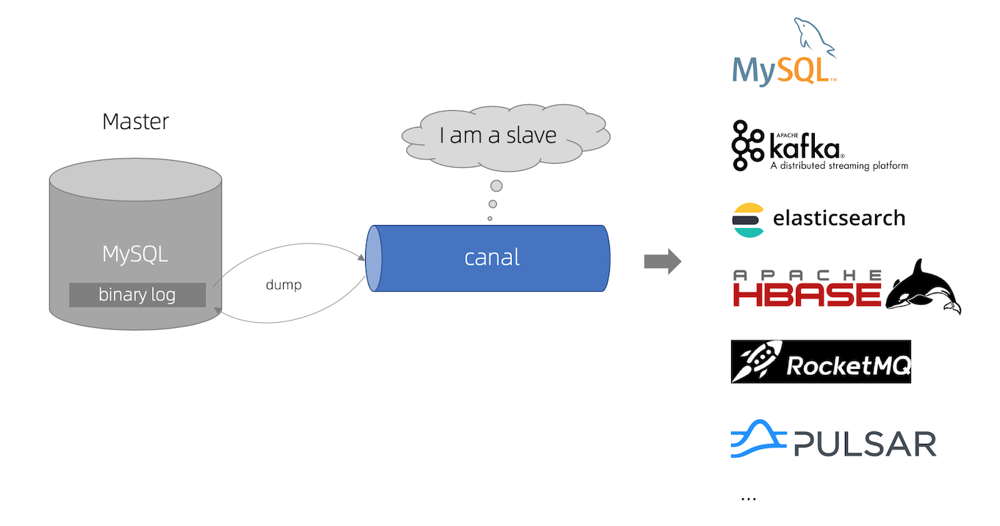

## 简介

[](https://camo.githubusercontent.com/63881e271f889d4a424c55cea2f9c2065f63494fecac58432eac415f6e47e959/68747470733a2f2f696d672d626c6f672e6373646e696d672e636e2f32303139313130343130313733353934372e706e67)

[**canal [kə'næl]**](https://github.com/alibaba/canal.git)，译意为水道/管道/沟渠，主要用途是基于 MySQL 数据库增量日志解析，提供增量数据订阅和消费

早期阿里巴巴因为杭州和美国双机房部署，存在跨机房同步的业务需求，实现方式主要是基于业务 trigger 获取增量变更。从 2010 年开始，业务逐步尝试数据库日志解析获取增量变更进行同步，由此衍生出了大量的数据库增量订阅和消费业务。

基于日志增量订阅和消费的业务包括

- 数据库镜像
- 数据库实时备份
- 索引构建和实时维护(拆分异构索引、倒排索引等)
- 业务 cache 刷新
- 带业务逻辑的增量数据处理

当前的 canal 支持源端 MySQL 版本包括 5.1.x , 5.5.x , 5.6.x , 5.7.x , 8.0.x

## 工作原理

#### MySQL主备复制原理

[](https://camo.githubusercontent.com/c26e367a6ffcce8ae6ecb39476a01bef14af6572124a6df050c4dc0c7f1074f3/687474703a2f2f646c2e69746579652e636f6d2f75706c6f61642f6174746163686d656e742f303038302f333038362f34363863316131342d653761642d333239302d396433642d3434616335303161373232372e6a7067)

- MySQL master 将数据变更写入二进制日志( binary log, 其中记录叫做二进制日志事件binary log events，可以通过 show binlog events 进行查看)
- MySQL slave 将 master 的 binary log events 拷贝到它的中继日志(relay log)
- MySQL slave 重放 relay log 中事件，将数据变更反映它自己的数据

#### canal 工作原理

- canal 模拟 MySQL slave 的交互协议，伪装自己为 MySQL slave ，向 MySQL master 发送dump 协议
- MySQL master 收到 dump 请求，开始推送 binary log 给 slave (即 canal )
- canal 解析 binary log 对象(原始为 byte 流)


## 实操

#### 准备工作

- 首先保证服务器的 `jdk` 环境已经就绪，因为 `canal` 是由 `java` 进行开发的，所以必须具备 `java` 运行环境。

```bash
wget https://github.com/alibaba/canal/releases/download/canal-1.1.6/canal.deployer-1.1.6.tar.gz # 下载

tar -zxvf canal.deployer-1.1.6.tar.gz -C ./canal # 解压到指定文件夹下
```


##### 安装 JDK

```bash
# 下载 tar.gz 包 https://www.oracle.com/java/technologies/javase/javase8-archive-downloads.html

tar -zxvf jdk-8u202-linux-x64.tar.gz -C JDK/ # 解压 目录是 /root/JDK

vi /etc/profile # ~/.bash_profile 添加 JAVA 相关变量，如下：
```

```properties
export JAVA_HOME=/root/JDK/jdk1.8.0_202
export JRE_HOME=${JAVA_HOME}/jre
export CLASSPATH=.:${JAVA_HOME}/lib:${JRE_HOME}/lib:$CLASSPATH
export JAVA_PATH=${JAVA_HOME}/bin:${JRE_HOME}/bin
export PATH=$JAVA_HOME/bin:$JRE_HOME/bin/$JAVA_HOME:$PATH
```

```bash
source /etc/profile # source ~/.bash_profile 刷新环境变量

java -version
#[root@iZbp1a8nvld17ybfu7cemtZ ~]# java -version
#java version "1.8.0_202"
#Java(TM) SE Runtime Environment (build 1.8.0_202-b08)
#Java HotSpot(TM) 64-Bit Server VM (build 25.202-b08, mixed mode)

#[root@iZbp1a8nvld17ybfu7cemtZ ~]# which java
#/root/JDK/jdk1.8.0_202/bin/java
```


```mysql
show variables like 'log_bin';

show binary logs;
```

> https://blog.csdn.net/fei_thefirst/article/details/120727544
>
> https://blog.csdn.net/yehongzhi1994/article/details/107880162
>
> https://www.modb.pro/db/126925
>
> https://github.com/alibaba/canal/wiki/QuickStart
>
> https://github.com/alibaba/canal/tree/canal-1.1.6
>
> [Canal高可用架构部署](https://mp.weixin.qq.com/s/QwvmxqxXirjf-J6mqYY44Q)
>
> [全量同步Elasticsearch方案之Canal](https://zhuanlan.zhihu.com/p/360631964)


### FAQ / 常见问题解答

1. 启动 canal 报错

   ```log
   2022-05-30 13:49:43.647 [destination = example , address = rm-bp108fv564w70h289wo.mysql.rds.aliyuncs.com/47.111.55.63:3306 , EventParser] ERROR c.a.o.c.p.inbound.mysql.rds.RdsBinlogEventParserProxy - dump address rm-bp108fv564w70h289wo.mysql.rds.aliyuncs.com/47.111.55.63:3306 has an error, retrying. caused by 
   com.google.common.util.concurrent.UncheckedExecutionException: com.alibaba.fastjson2.JSONException: read field error : clientDatas
   	at com.google.common.cache.LocalCache$Segment.get(LocalCache.java:2218) ~[guava-22.0.jar:na]
   	at com.google.common.cache.LocalCache.get(LocalCache.java:4147) ~[guava-22.0.jar:na]
   	at com.google.common.cache.LocalCache.getOrLoad(LocalCache.java:4151) ~[guava-22.0.jar:na]
   	at com.google.common.cache.LocalCache$LocalLoadingCache.get(LocalCache.java:5140) ~[guava-22.0.jar:na]
   	at com.google.common.collect.MigrateMap$MigrateConcurrentMap.get(MigrateMap.java:68) ~[canal.common-1.1.6.jar:na]
   	at com.alibaba.otter.canal.meta.MemoryMetaManager.listAllSubscribeInfo(MemoryMetaManager.java:72) ~[canal.meta-1.1.6.jar:na]
   	at com.alibaba.otter.canal.parse.index.MetaLogPositionManager.getLatestIndexBy(MetaLogPositionManager.java:52) ~[canal.parse-1.1.6.jar:na]
   	at com.alibaba.otter.canal.parse.index.FailbackLogPositionManager.getLatestIndexBy(FailbackLogPositionManager.java:68) ~[canal.parse-1.1.6.jar:na]
   	at com.alibaba.otter.canal.parse.inbound.mysql.MysqlEventParser.findStartPositionInternal(MysqlEventParser.java:416) ~[canal.parse-1.1.6.jar:na]
   	at com.alibaba.otter.canal.parse.inbound.mysql.MysqlEventParser.findStartPosition(MysqlEventParser.java:358) ~[canal.parse-1.1.6.jar:na]
   	at com.alibaba.otter.canal.parse.inbound.AbstractEventParser$1.run(AbstractEventParser.java:191) ~[canal.parse-1.1.6.jar:na]
   	at java.lang.Thread.run(Thread.java:748) [na:1.8.0_202]
   Caused by: com.alibaba.fastjson2.JSONException: read field error : clientDatas
   	at com.alibaba.fastjson2.reader.FieldReaderObjectMethod.readFieldValue(FieldReaderObjectMethod.java:92) ~[fastjson2-2.0.4.jar:na]
   	at com.alibaba.fastjson2.reader.ObjectReader2.readObject(ObjectReader2.java:241) ~[fastjson2-2.0.4.jar:na]
   	at com.alibaba.fastjson2.JSON.parseObject(JSON.java:258) ~[fastjson2-2.0.4.jar:na]
   	at com.alibaba.otter.canal.common.utils.JsonUtils.unmarshalFromString(JsonUtils.java:51) ~[canal.common-1.1.6.jar:na]
   	at com.alibaba.otter.canal.meta.FileMixedMetaManager.loadDataFromFile(FileMixedMetaManager.java:175) ~[canal.meta-1.1.6.jar:na]
   	at com.alibaba.otter.canal.meta.FileMixedMetaManager.loadClientIdentity(FileMixedMetaManager.java:225) ~[canal.meta-1.1.6.jar:na]
   	at com.google.common.collect.MigrateMap$1.load(MigrateMap.java:23) ~[canal.common-1.1.6.jar:na]
   	at com.google.common.cache.LocalCache$LoadingValueReference.loadFuture(LocalCache.java:3708) ~[guava-22.0.jar:na]
   	at com.google.common.cache.LocalCache$Segment.loadSync(LocalCache.java:2416) ~[guava-22.0.jar:na]
   	at com.google.common.cache.LocalCache$Segment.lockedGetOrLoad(LocalCache.java:2299) ~[guava-22.0.jar:na]
   	at com.google.common.cache.LocalCache$Segment.get(LocalCache.java:2212) ~[guava-22.0.jar:na]
   	... 11 common frames omitted
   Caused by: com.alibaba.fastjson2.JSONException: read field error : cursor
   	at com.alibaba.fastjson2.reader.FieldReaderObjectMethod.readFieldValue(FieldReaderObjectMethod.java:92) ~[fastjson2-2.0.4.jar:na]
   	at com.alibaba.fastjson2.reader.ObjectReader2.readObject(ObjectReader2.java:243) ~[fastjson2-2.0.4.jar:na]
   	at com.alibaba.fastjson2.reader.ObjectReaderImplList.readObject(ObjectReaderImplList.java:435) ~[fastjson2-2.0.4.jar:na]
   	at com.alibaba.fastjson2.reader.FieldReaderObjectMethod.readFieldValue(FieldReaderObjectMethod.java:90) ~[fastjson2-2.0.4.jar:na]
   	... 21 common frames omitted
   Caused by: com.alibaba.fastjson2.JSONException: read field error : identity
   	at com.alibaba.fastjson2.reader.FieldReaderObjectMethod.readFieldValue(FieldReaderObjectMethod.java:92) ~[fastjson2-2.0.4.jar:na]
   	at com.alibaba.fastjson2.reader.ObjectReader2.readObject(ObjectReader2.java:241) ~[fastjson2-2.0.4.jar:na]
   	at com.alibaba.fastjson2.reader.FieldReaderObjectMethod.readFieldValue(FieldReaderObjectMethod.java:90) ~[fastjson2-2.0.4.jar:na]
   	... 24 common frames omitted
   Caused by: com.alibaba.fastjson2.JSONException: read field error : sourceAddress
   	at com.alibaba.fastjson2.reader.FieldReaderObjectMethod.readFieldValue(FieldReaderObjectMethod.java:92) ~[fastjson2-2.0.4.jar:na]
   	at com.alibaba.fastjson2.reader.ObjectReader2.readObject(ObjectReader2.java:243) ~[fastjson2-2.0.4.jar:na]
   	at com.alibaba.fastjson2.reader.FieldReaderObjectMethod.readFieldValue(FieldReaderObjectMethod.java:90) ~[fastjson2-2.0.4.jar:na]
   	... 26 common frames omitted
   Caused by: com.alibaba.fastjson2.JSONException: create instance error, class java.net.InetSocketAddress
   	at com.alibaba.fastjson2.reader.ObjectReaderAdapter.createInstance0(ObjectReaderAdapter.java:178) ~[fastjson2-2.0.4.jar:na]
   	at com.alibaba.fastjson2.reader.ObjectReaderAdapter.createInstance(ObjectReaderAdapter.java:233) ~[fastjson2-2.0.4.jar:na]
   	at com.alibaba.fastjson2.reader.ObjectReaderBean.readObject(ObjectReaderBean.java:162) ~[fastjson2-2.0.4.jar:na]
   	at com.alibaba.fastjson2.reader.FieldReaderObjectMethod.readFieldValue(FieldReaderObjectMethod.java:90) ~[fastjson2-2.0.4.jar:na]
   	... 28 common frames omitted
   ```

   解决方法：

   先停止 `canal` ，把 `conf->example->meta.dat` 文件删除，再重启 `canal` ;
   重启会重新生成 `meta.dat` 文件,所记录的最新 `binlog` 文件和位置

   

```shell
# insert
================> binlog[mysql-bin.002686 : 257880],name[test_suyoda_net,auth_center_sub_role], eventType: INSERT
id : 12  update= true
uid : 1  update= true
name : XR测试2  update= true
status : 1  update= true
menu_ids : 96,25,26,97,98,99,100,101,102,103,104,27,28,105,29  update= true
================> binlog[mysql-bin.002686 : 258066],name[test_suyoda_net,auth_center_sub_role], eventType: INSERT
id : 13  update= true
uid : 1  update= true
name : XR测试3  update= true
status : 1  update= true
menu_ids : 96,25,26,97,98,99,100,101,102,103,104,27,28,105,29  update= true


# update
================> binlog[mysql-bin.002686 : 264579],name[test_suyoda_net,auth_center_sub_role], eventType: UPDATE
-------> before
id : 13  update= false
uid : 1  update= false
name : XR测试3  update= false
status : 1  update= false
menu_ids : 96,25,26,97,98,99,100,101,102,103,104,27,28,105,29  update= false
-------> after
id : 13  update= false
uid : 1  update= false
name : XR测试3  update= false
status : 1  update= false
menu_ids : 96,25,26,97,98,99,100,101,102,103,104,27,28,105,30  update= true
================> binlog[mysql-bin.002686 : 264838],name[test_suyoda_net,auth_center_sub_role], eventType: UPDATE
-------> before
id : 12  update= false
uid : 1  update= false
name : XR测试2  update= false
status : 1  update= false
menu_ids : 96,25,26,97,98,99,100,101,102,103,104,27,28,105,29  update= false
-------> after
id : 12  update= false
uid : 1  update= false
name : XR测试2  update= false
status : 1  update= false
menu_ids : 96,25,26,97,98,99,100,101,102,103,104,27,28,105  update= true

# delete
================> binlog[mysql-bin.002686 : 266562],name[test_suyoda_net,auth_center_sub_role], eventType: DELETE
id : 13  update= false
uid : 1  update= false
name : XR测试3  update= false
status : 1  update= false
menu_ids : 96,25,26,97,98,99,100,101,102,103,104,27,28,105,30  update= false
================> binlog[mysql-bin.002686 : 266748],name[test_suyoda_net,auth_center_sub_role], eventType: DELETE
id : 12  update= false
uid : 1  update= false
name : XR测试2  update= false
status : 1  update= false
menu_ids : 96,25,26,97,98,99,100,101,102,103,104,27,28,105  update= false
```

