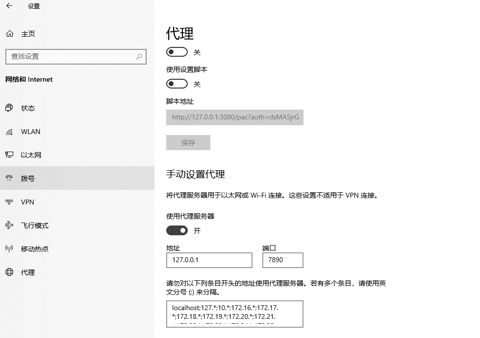

## 知识

> [一个学习 Git 的网站 Learn Git Branching](https://learngitbranching.js.org/)


## 常见问题

1. ### 代理问题

   提示：

   ```shell
   fatal: unable to access 'https://github.com/***/': Failed to connect to 127.0.0.1 port 31181: Connection refused
   ```

   查询是否使用代理：

   ```shell
   git config --global http.proxy
   ```

    取消代理：

   ```shell
   git config --global --unset http.proxy
   ```

   ?> 经过以上处理，还是经常出问题，并且我这边使用了 `Clash For Windows` 设置了代理，所以也可以使用下述方法：

   报错：

   ```bash
   fatal: unable to access 'https://github.com/xiaoxian521/tauri-pure-admin.git/': Failed to connect to github.com port 443 after 21101 ms: Timed out
   ```

   解决，设置代理，端口为 `7890`：

   ```bash
   git config --global http.proxy http://127.0.0.1:7890
   ```

   

   

2. ### `OpenSSL`

   提示：

   ```shell
   fatal: unable to access 'https://github.com/NoddingFish/docsify-technical-note.git/': Failed to connect to github.com port 443: Timed out
   ```

   解决：

   ```shell
   git config http.sslVerify "false"
   git config --global http.sslVerify "false"
   ```

3. ### `Git Status` 中文显示问题

   ```bash
   git config --global core.quotepath false
   
   #在使用 git 1og 出现乱码上面一个设置不能解决问题需要再做以下设置
   
   git config --global gui.encoding utf-8
   
   git config --global i18n.commit.encoding utf-8
   
   git config --global i18n.logoutputencoding utf-8
   
   export LES5CHAR5ET=utf-8#添加到环境变里
   ```

   