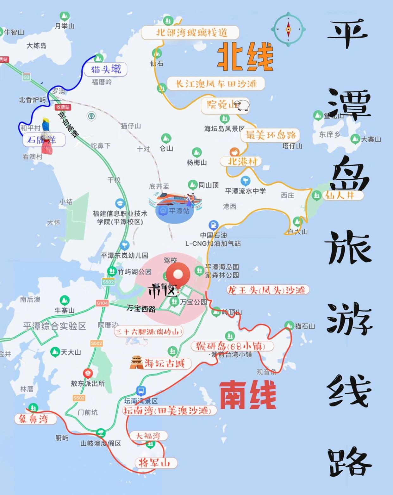
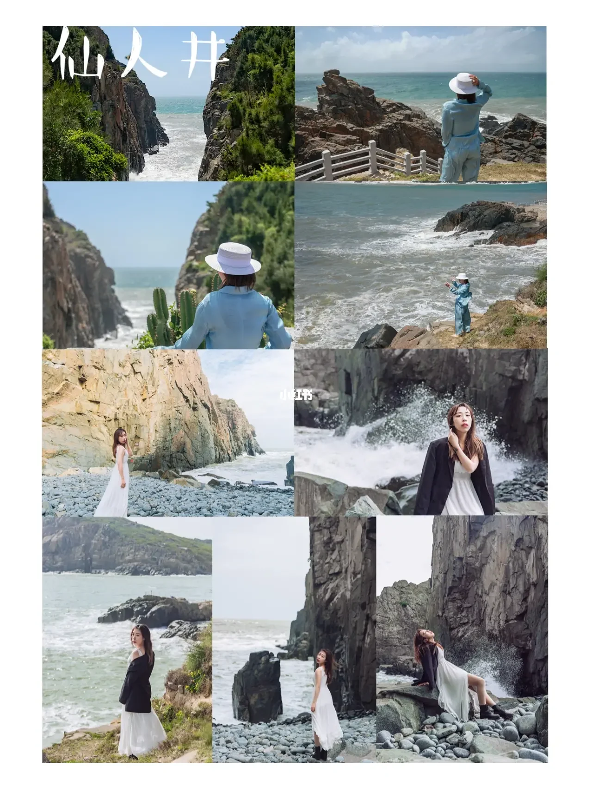

### 必备

1. 防晒：防晒衣、防晒霜、墨镜、帽子；
2. 水杯
3. 防水袋，相机
4. 泳衣泳裤泳镜

### 线路

平潭环岛旅游线路：

①北线游玩(85公里）/龙凤头沙滩—东海仙境（观日出最佳地点)—仙人井（大自然的鬼斧神工)—北港文创村（北港租车店)—最美环岛路段—渔屿村（拍婚纱照最佳地点)—北岚岭（俯瞰脚下浩瀚的大海)—镜沙（阴天出大片的黑沙滩）—沙地底（平潭小中卫）—长江澳风车田（观日落最佳地点，蓝眼泪爆发点)—北部湾生态廊道（全海景玻璃栈道)—返程

②南线游玩（90公里）/猴岩岛（祖国大陆离台湾最近的地方)—海坛古城（古城租车店）—坛南湾（最干净的沙滩，蓝眼泪爆发点)—将军山（三军联合作战地点)—大福湾（小白桥最佳拍摄地)—象鼻湾（有航拍器的伙伴们高空拍摄非常美）—返程

### 攻略

> 摘：[福建平潭旅游攻略分享（贼全）](https://mbd.baidu.com/newspage/data/dtlandingsuper?nid=dt_4946206814437333917)

看了不迷路！！福建平潭旅游攻略分享（贼全）
🎈攻略分为南、北、线两篇给大家介绍（图上橙色北线、红色南线）
🎈以下攻略包含各景点大图以及不同视角拍摄（仅供参考）
🎈附图无滤镜没有大幅度调色，天气不同有差异，出发前记得查查天气喔
🎈最佳游玩时间4月～10月，其余时间风比较大，夏天去哪里都热，防晒做好就Ok啦
🎈4~6是蓝眼泪爆发季，也是岚岛的一大亮点，看运气，可关注网络动态平潭追泪群了解
🎈南线关键词：水上项目（快艇、冲浪🏄‍♀️、浮潜、出海、摩托艇🛥️等）日出、海蚀地貌
✈️交通
🚄：长乐机场自驾——平潭开车约1小时
🚄：长乐东站——平潭站约20分钟
（长乐机场打车——平潭站约30分钟）
🚄：福州站/南站——平潭站约30～50分钟
🚄：厦门/厦门北站——平潭约3小时
🚗：福州自驾——平潭约1小时20分钟
🚦吃饭和住宿市区较为方便，是在南北线中间比较推荐
📒北线可移步另一边笔记

🌊🌊🌊🌊🌊🌊🌊南线🌊🌊🌊🌊🌊🌊🌊

🎈景点相邻较远，建议全程自驾或打车包车
🎈晚上想在沙滩散步的可以在龙凤头或者坛南湾，人多热闹些，吃的也有，感觉更安全一些喔

1. 平潭旅游攻略路线图

2. 龙凤头（龙王头沙滩）：看海上日出，水上项目游玩，离市区近，配套比较成熟吃的玩的都有，缺点是高峰期人巨多

3. 猴研岛（68小镇）：🎫38r/人，离台湾最近（68海里）的岛屿，由三个小岛组成，全程走完2小时，也可做观光车10r/人（部分路段）墨水石柱、怪石是猴研岛的特色

4. 海壇古城：给人的印象是一般地方都有的古城，没事晚上可以逛逛，夜景好看一些

5. 坛南湾：全程比较长，大大小小有13段沙滩，基岩岬角与邻近沙滩分隔并不相通，直接导航到坛南湾可到“田美澳/远垱澳”沙滩，设施成熟，吃的玩的都有

6. 三十六脚湖：福建省最大的天然淡水湖，面积210万平方米，有种小瑞士的赶脚，很美，离市区近，露营⛺️也不错

7. 大福湾：在将军山背后，是一个码头，地方不大。到白色方门的位置路程需要爬一段山，全程约40分钟

8. 将军山：🎫20r/人，将军山,海拔104米,东临台湾海峡，爱国主义教育基地，摩崖石周围还有一线天、石林等天然景观，全程约一个半小时

9. 象鼻湾：景点为未开发状态，可看日落，要看到象鼻效果需要涨潮时间，全景需要无人机才有象鼻形状。缺点位置比较远，可赶海

   🎈祝大家都有个愉快的旅程快点和你的好朋友到海边玩👭👭👭

（北线）福建平潭岛旅游攻略～附风景线路图

🎈攻略分为南、北两条线路介绍
🎈北线关键词：风车、黑礁石、日落、滩涂
📒南线可移步另一边笔记

🍃🍃🍃🍃🍃🍃🍃北线🍃🍃🍃🍃🍃🍃🍃

🎈北线景点相临较近，可以骑电动车，景点比较多记得看电动车可骑公里数（可选）民宿酒店都有的租，有带小朋友和老人的建议自驾

1. 仙人井：🎫门票21 r/人，从停车场到景点入口约1km，观光车10r/人（可选择），沿阶梯而上，山不高，到顶看海是俯瞰效果。全程走完大概约1个小时。

2. 北港文创村：平潭特色古石厝老屋之一，高低错落，民宿很多，住的高可直接看海。退潮可以赶海（小沙滩）全程走完约1小时，这里地势错落走起来比较累。

3. 最美环岛路：沿路就是海🌊很出片，缺点是就在马路边，自驾不好停车

4. 院宛山：这里有🌊有🌸有🍃有小🐑，这里可以喂小羊喔，整个画面都很治愈。

5. 镜沙：网红黑沙滩，大片感，记得看潮汐时间，退潮时石头比较黑（那个门洞效果退潮才能拍的到）天晴石头反光，缺点是海蟑螂比较多，石头路不好走，全程约30~60分钟（沙地底在附近）

6. 长江澳：平潭三大海滩之一，晚霞🌄日落、风车，找个好天气就来吧，退潮可赶海，每年蓝眼泪都会光临的地方

7. 北部湾玻璃栈道：面朝大海的悬壁栈道，一般山⛰️一半海🌊，可看海上风车，玻璃栈道上可以看到海上落日

8. 猫头乾：（感受四面环海）有点北港➕北部湾➕将军山感觉，缺点是比较远，要爬山喔，真正的《登高望远》

9. 石牌洋（七彩石）：导航和平码头就可以看到彩色石头，和平村那条路也就在背对石头的左手边。

   

   ✏️提示：字数限制，线路图以及南线可移步另外一篇笔记!

